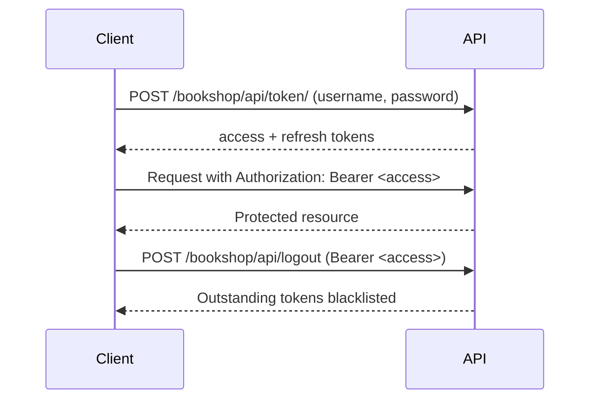

<div align="center">

# Django REST Framework API

A hands-on Django REST Framework API covering the core DRF building blocks — serializers, views, permissions, JWT authentication, throttling and pagination.

[](https://www.python.org/)
[](https://www.djangoproject.com/)
[](https://www.django-rest-framework.org/)
[](https://www.postgresql.org/)
[](LICENSE)

</div>

---

## 📖 Overview

This project is a single Django backend made of four small apps, each demonstrating a different part of the Django REST Framework. It is intended as a practical reference for how DRF views, serializers, custom validation and authentication fit together.

- **`blog_api`** — minimal function-based and class-based views
- **`bookstore`** — a `Book` model exposed for listing and creation
- **`bookshop`** — related models with nested serializers, a custom permission class and JWT auth
- **`vip_users`** — a standalone user model with CRUD and custom serializer validation

**Tech stack:** Python · Django · Django REST Framework · SimpleJWT · PostgreSQL

---

## ✨ Features

- 🔐 **JWT authentication** — token obtain, refresh and blacklist-based logout via `djangorestframework-simplejwt`
- 👤 **User management** — user CRUD with custom field-level and object-level validation
- 📦 **CRUD operations** — list, create, update and delete endpoints built on `APIView`
- 🧩 **Nested serializers** — foreign key and many-to-many relations rendered inline
- 🚫 **Custom permissions** — `BlocklistPermission` denies access to blocked users
- 🔄 **Serializer customization** — `SerializerMethodField`, `to_representation` and custom validators
- ⏱️ **Throttling** — anonymous and per-user rate limits configured globally
- 📄 **Pagination** — `LimitOffsetPagination` with a page size of 100 configured globally
- 🛠️ **Django admin** — bookshop models registered for administration

---

## 📂 Project Structure

```text
django-rest-framework/
├── config/                 # Project configuration
│   ├── settings.py         # Apps, database, DRF settings (auth, throttle, pagination)
│   ├── urls.py             # Root URL routing
│   ├── asgi.py
│   └── wsgi.py
├── blog_api/               # Basic DRF views
│   ├── urls.py
│   └── views.py            # Function-based view + APIView
├── bookstore/              # Book listing & creation
│   ├── models.py           # Book
│   ├── serializers.py      # BookSerializer
│   ├── urls.py
│   └── views.py
├── bookshop/               # Nested serializers, auth & permissions
│   ├── models.py           # Author, Category, MyBook, BlockUserModel
│   ├── serializers.py      # Nested MyBookSerializer
│   ├── permissions.py      # BlocklistPermission
│   ├── urls.py
│   └── views.py
├── vip_users/              # User CRUD with validation
│   ├── models.py           # User
│   ├── serializer.py       # UserSerializer
│   ├── urls.py
│   └── views.py
├── manage.py
├── LICENSE
└── .gitignore
```

---

## 🚀 Installation & Setup

### 1. Clone the repository

```bash
git clone <your-repository-url>
cd django-rest-framework
```

### 2. Create and activate a virtual environment

```bash
python -m venv venv

# macOS / Linux
source venv/bin/activate

# Windows
venv\Scripts\activate
```

### 3. Install dependencies

The project does not ship a `requirements.txt` yet, so install the packages it needs — those imported by the code plus the driver for the configured database backend:

```bash
pip install django djangorestframework djangorestframework-simplejwt "psycopg[binary]"
```

> `psycopg` is required by the PostgreSQL backend configured in `config/settings.py`.
> If you prefer SQLite, uncomment the SQLite `DATABASES` block in that file and skip `psycopg`.

### 4. Configure the database

Create a PostgreSQL database named `django_project_db`, then update the `DATABASES` settings in `config/settings.py` to match your local PostgreSQL credentials.

```bash
createdb django_project_db
```

### 5. Apply migrations

```bash
python manage.py migrate
```

### 6. Create a superuser (for the Django admin)

```bash
python manage.py createsuperuser
```

### 7. Start the development server

```bash
python manage.py runserver
```

The API is now available at `http://127.0.0.1:8000/`, and the Django admin at `http://127.0.0.1:8000/admin/`.

> ⚠️ `SECRET_KEY`, `DEBUG = True` and the database credentials are hardcoded in `config/settings.py`. Move them to environment variables before deploying anywhere public.

---

## 🔌 API Endpoints

### Blog API — `/api/`

| Method | Endpoint | Description |
|---|---|---|
| `GET` | `/api/hello/?name=<name>` | Hello World (function-based view) |
| `GET` | `/api/hello-class/?name=<name>` | Hello World (class-based `APIView`) |
| `POST` | `/api/hello-class/` | Hello World, reads `name` from the request body |

### Bookstore — `/bookstore/`

| Method | Endpoint | Description |
|---|---|---|
| `GET` | `/bookstore/books/` | List all books |
| `POST` | `/bookstore/books/` | Create a new book |

### VIP Users — `/vip-users/`

| Method | Endpoint | Description |
|---|---|---|
| `GET` | `/vip-users/vip-users/` | List all users |
| `POST` | `/vip-users/vip-users/` | Create a user |
| `PUT` | `/vip-users/vip-users/<pk>/` | Update a user (partial update) |
| `DELETE` | `/vip-users/vip-users/<pk>/` | Delete a user |

### Bookshop — `/bookshop/`

| Method | Endpoint | Description |
|---|---|---|
| `GET` | `/bookshop/bookshop/` | List books with nested author and categories |
| `GET` | `/bookshop/user/` | Current user information (blocklist permission) |
| `GET` | `/bookshop/b/<pk>` | Retrieve a single book |
| `DELETE` | `/bookshop/b/<pk>` | Delete a book |
| `POST` | `/bookshop/api/token/` | Obtain an access/refresh JWT pair |
| `POST` | `/bookshop/api/token/refresh/` | Refresh an access token |
| `POST` | `/bookshop/api/logout` | Blacklist all outstanding tokens (auth required) |

---

## 🧪 Example API Usage

**Hello World**

```http
GET /api/hello/?name=Ali
```

```json
{
  "message": "Hello, Ali!"
}
```

**Create a book**

```http
POST /bookstore/books/
Content-Type: application/json

{
  "title": "Clean Code",
  "author": "Robert C. Martin",
  "published_date": "2008-08-01",
  "isbn": "9780132350884",
  "pages": 464,
  "language": "English"
}
```

```json
{
  "message": "Book created successfully",
  "book": {
    "id": 1,
    "title": "Clean Code",
    "author": "Robert C. Martin",
    "published_date": "2008-08-01",
    "isbn": "9780132350884",
    "pages": 464,
    "language": "English"
  }
}
```

**Create a VIP user**

```http
POST /vip-users/vip-users/
Content-Type: application/json

{
  "username": "ali",
  "email": "ali@example.com",
  "password": "strongpass123",
  "is_vip": true
}
```

```json
{
  "id": 1,
  "username": "ALI",
  "email": "ali@example.com",
  "password": "strongpass123",
  "is_vip": true,
  "bio": "ali is a VIP user."
}
```

> The username is upper-cased in responses, and `password` must be at least 8 characters long.

---

## 🔐 Authentication

Authentication uses **JWT** (`djangorestframework-simplejwt`), configured as the project's default authentication class in `config/settings.py`.



**1. Obtain a token pair**

```http
POST /bookshop/api/token/
Content-Type: application/json

{
  "username": "ali",
  "password": "strongpass123"
}
```

```json
{
  "refresh": "<refresh-token>",
  "access": "<access-token>"
}
```

**2. Call protected endpoints** by sending the access token in the header:

```http
Authorization: Bearer <access-token>
```

**3. Refresh an expired access token**

```http
POST /bookshop/api/token/refresh/
Content-Type: application/json

{
  "refresh": "<refresh-token>"
}
```

**4. Log out** — blacklists every outstanding token for the authenticated user:

```http
POST /bookshop/api/logout
Authorization: Bearer <access-token>
```

```json
{
  "message": "Logout success"
}
```

A custom `BlocklistPermission` additionally denies access to users listed in `BlockUserModel`, and global throttling limits requests to 100/day for anonymous users and 1000/day for authenticated users.

> No Swagger or OpenAPI schema is set up. Every endpoint is still explorable in the browser through DRF's built-in browsable API — just open the URL while the dev server is running.

---

## 📄 License

Released under the [MIT License](LICENSE) © 2026 Mohammad Hossein.
